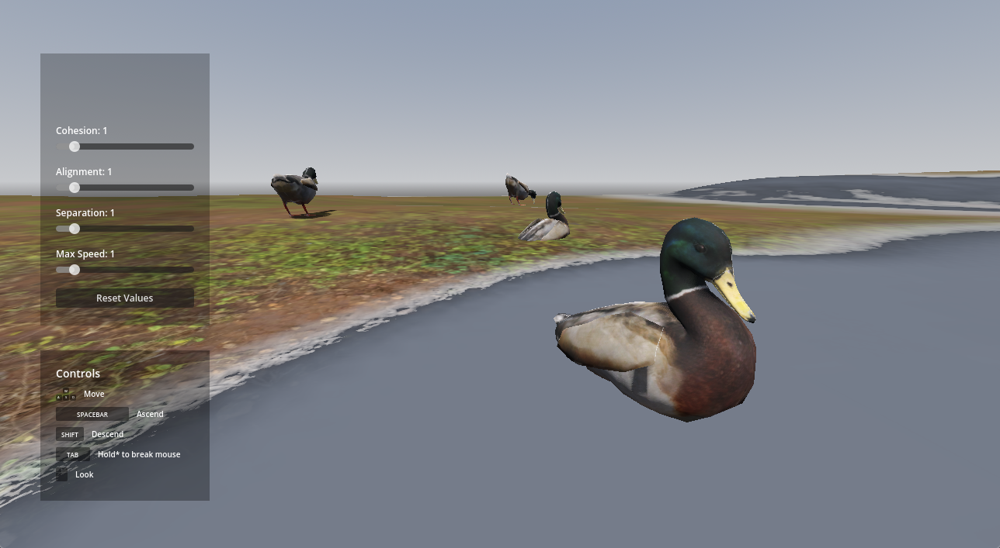
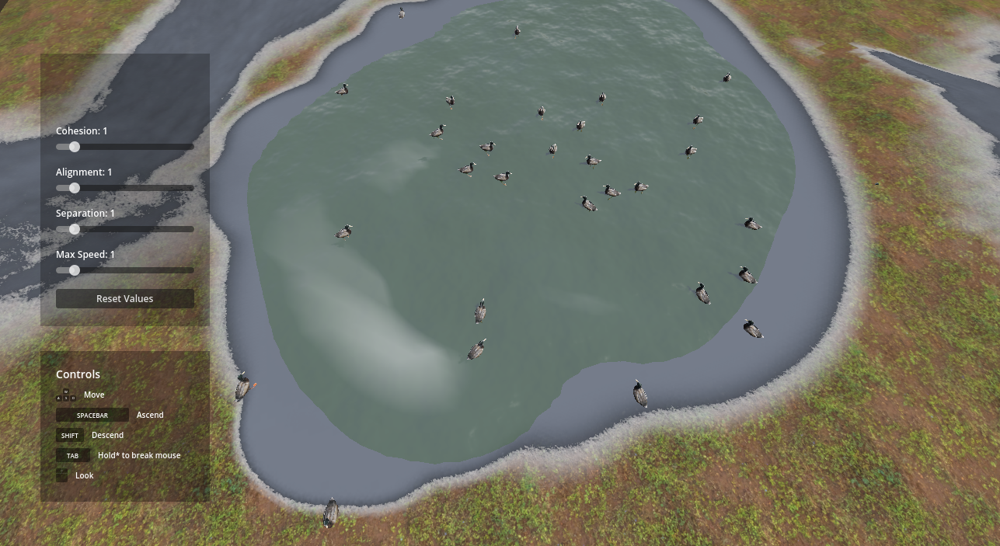
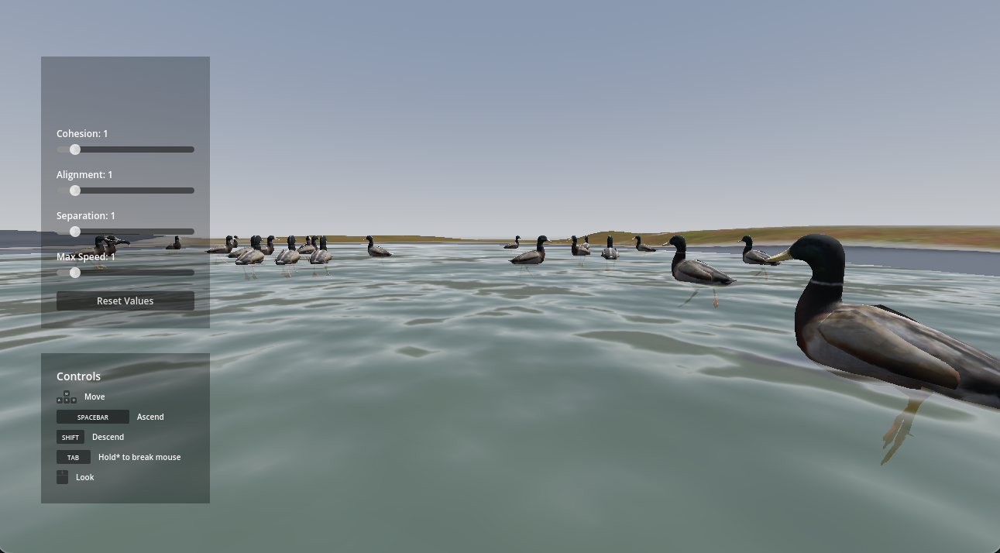
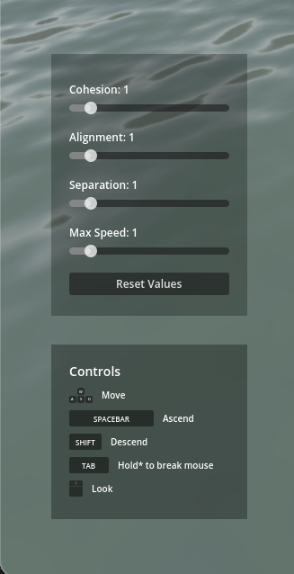

# Project Title

Name: Duck Simulator X

Student Number: C18424946

Class Group: TU-857

# Description

Duck Simulator X is a game developed with Godot that simulates the behaviors of ducks in their natural environment. The game utilises boid techniques which are a set of simple rules that allow ducks to exhibit emergent behavior. Additionally, the state machine design pattern is implemented to manage the ducks' behaviors by dividing them into a finite set of states. The game also features a graphical user interface that enables users to adjust various behavior parameters adding to an interactive simulation experience.

## Video:

## Screenshots

# Instructions

To run, fork this repository, download and import the project into Godot and hit the play icon (top right in the editor).

# How it works

The Flock class begins by spawning ducks either on the lake or on 1 of 3 shore locations. The ducks are then given random states based on whether they are on land or not, the game uses weights that favor the most of the ducks to be in the pond. Inside these states lies logic that turns on/off certain behaviors (wander/cohesion/constrain) in the duck instance so if a duck is sleeping all flocking behaviors are disabled or if a duck needs to rejoin the flock sac rules are re-enabled. State changes are handled mostly at random inside the StateMachine class, it uses a timer to determine when a duck should change state or not. Some states change when conditions are met such as when a duck arrives within distance to a location, the appropriate state is then chosen.

The possibility to adjust the weight of behaviours is facilitated through a graphical user interface. This implemention uses a combination of signals and a singelton pattern (autoload feature in Godot) to achieve this. Each slider holds a corresponding signal which when changed emits a signal with the new value to a subscribed script. The singleton pattern is used here as it acts as a centralised location to store these individual weight values allowing any script to access it's information conveniently from anywhere. Inside each behaviour class the weight belonging to that class is set to the weight stored in the global script. `self.weight = GameSettings.cohesion_weight` This instantly reflects in the behavior of the ducks depending on which parameter is modified.

Sounds are also chosen at random by a script attached to a 3D node. A timer is set on repeat and at random intervals it to cycles through a list of sounds attached as child nodes. Ambient park noise is played in the background on loop to add to the immersion.

# What did I learn?

# List of Classes

| Class/asset | Source |
|-------------|--------|
| Boid | Modified from [reference](https://github.com/skooter500/miniature-rotary-phone/blob/main/minature-rotary-phone/behaviors/Boid.gd) |
| SteeringBehavior | From [reference](https://github.com/skooter500/miniature-rotary-phone/blob/main/minature-rotary-phone/behaviors/SteeringBehavior.gd) |
| Separation | Modified from [reference](https://github.com/skooter500/miniature-rotary-phone/blob/main/minature-rotary-phone/behaviors/Separation.gd) |
| Alignment | Modified from [reference](https://github.com/skooter500/miniature-rotary-phone/blob/main/minature-rotary-phone/behaviors/Alignment.gd) |
| Cohesion | Modified from [reference](https://github.com/skooter500/miniature-rotary-phone/blob/main/minature-rotary-phone/behaviors/Cohesion.gd) |
| Constrain | From [reference](https://github.com/skooter500/miniature-rotary-phone/blob/main/minature-rotary-phone/behaviors/Constrain.gd) |
| Seek | Modified from [reference](https://github.com/skooter500/miniature-rotary-phone/blob/main/minature-rotary-phone/behaviors/Seek.gd) |
| Wander | Modified from [reference](https://github.com/skooter500/miniature-rotary-phone/blob/main/minature-rotary-phone/behaviors/Wander.gd) |
| StateMachine | Self written |
| State | Modified from [reference](https://github.com/skooter500/miniature-rotary-phone/blob/main/minature-rotary-phone/behaviors/State.gd) |
| Swim | Self written |
| SwimToShore | Self written |
| Sleep | Self written |
| Walk | Self written |
| ReturnToPond | Self written |

## Miscellaneous Scripts (Non-classes)

| Class/asset | Source |
|-------------|--------|
| Sound Script | Self written |
| User Interface Script | Self written |
| Player Movement Script | Self written |

# References

## Sounds

| Class/asset | Source |
|-------------|--------|
| duck quaking sound effect.mp3 | From [reference](https://www.youtube.com/watch?v=aFQoM1JHzQY) |
| Ducks Quacking Sound Effect Ringtone.mp3 | From [reference](https://www.youtube.com/watch?v=2Xy9NjGfJZo) |
| Duck sound #shorts Please subscribe.mp3 | From [reference](https://www.youtube.com/shorts/rVEaanykP2I) |
| Male Duck Quacking.mp3 | From [reference](https://www.youtube.com/shorts/PF4XIHLYQRA) |
| Park ambience sound (Royalty Free).mp3 | From [reference](https://www.youtube.com/watch?v=e_zCM0EobAY) |

Additionally, Each sound used is embedded as metadata on the attached node, displaying the source url.

## 3D Models/Textures

| Class/asset | Source |
|-------------|--------|
| Duck 3D Model | From [reference](https://sketchfab.com/3d-models/duck-07b9786ed84244b2acefd48c709e4548) |
| Grass Texture | From [reference](https://polyhaven.com/a/brown_mud_leaves_01) |
| Gravel Texture | From [reference](https://polyhaven.com/a/brown_mud_rocks_01) |
